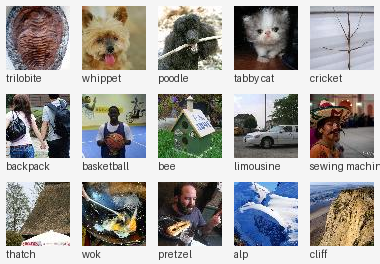
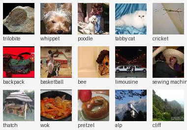

# Group1_Assignment

## Dataset Summary

This project uses a **15-class subset of Tiny ImageNet**, stored as serialized pickle files in the `data/` directory.

### Files

| File | Split | Images |
|------|-------|--------|
| `data/train-70_.pkl` | Training (70%) | 5,775 |
| `data/validation-10_.pkl` | Validation (10%) | 825 |

### Format

Each pickle file deserializes into a Python dict with the following keys:

- `images` — array of shape `(N, 64, 64, 3)`, uint8 RGB pixel values
- `labels` — list of integer class indices (0–199, Tiny ImageNet scale)
- `class_names` — dict mapping label index → synset ID (e.g. `{163: 'n04596742'}`)
- `all_classes` — full list of 200 Tiny ImageNet synset IDs (reference only)

### Sample Images

**Training set** (one image per class):

**Validation set** (one image per class):

### Classes (15 total)

| Label | Synset | Class |
|-------|--------|-------|
| 6 | n01768244 | trilobite |
| 22 | n02094433 | whippet |
| 26 | n02113799 | poodle |
| 28 | n02123394 | tabby cat |
| 35 | n02231487 | cricket |
| 57 | n02769748 | backpack |
| 62 | n02802426 | basketball |
| 70 | n02843684 | bee |
| 108 | n03670208 | limousine |
| 139 | n04259630 | sewing machine |
| 151 | n04417672 | thatch |
| 163 | n04596742 | wok |
| 173 | n07695742 | pretzel |
| 188 | n09193705 | alp |
| 189 | n09246464 | cliff |

### Notes

- Images are 64×64 RGB — same resolution as standard Tiny ImageNet
- Label indices are original Tiny ImageNet indices, so they are non-consecutive
- The same 15 classes appear in both train and validation splits
